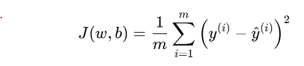

# Machine-Learning-Basic

### Evaluating a model
Model evaluation in machine learning is the process of assessing how well a trained model performs on <b>unseen</b> data. It involves using metrics and techniques to measure the model's accuracy, precision, or other relevant indicators depending on the task. The goal is to ensure the model generalizes effectively. Proper evaluation helps identify overfitting, underfitting, and areas for improvement, ensuring the model's reliability and effectiveness in real-world applications.

##### Training and Test Set
As mentioned earlier, evaluating a model requires unforeseen data to assess its performance effectively. However, collecting such data can often be costly and time-consuming.

A conventional and practical approach is to divide the existing dataset into two subsets: the training set and the test set.

The model is trained using the training set, where parameters (e.g., weights 𝑤 and biases b) are optimized by minimizing a cost function.

The test set, which remains unseen during training, is then used to evaluate the model's performance by computing test errors.

For instance, in regression tasks, a common cost function is the Mean Squared Error (MSE), given by: 

Here, 𝑚 represents the number of training examples, 𝑦(𝑖) is the actual output, and 𝑦(i) is the predicted output
<h6>Note: The first image is a screenshot taken from the Coursera Advanced Machine Learning course.</h6>
